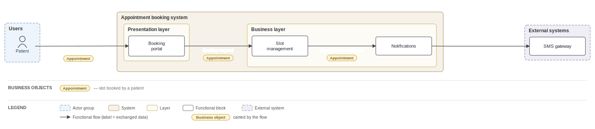
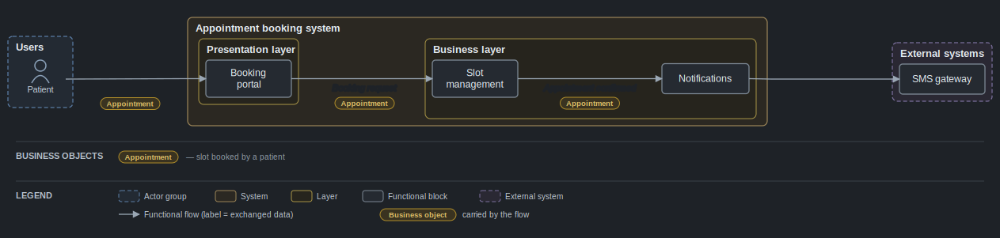
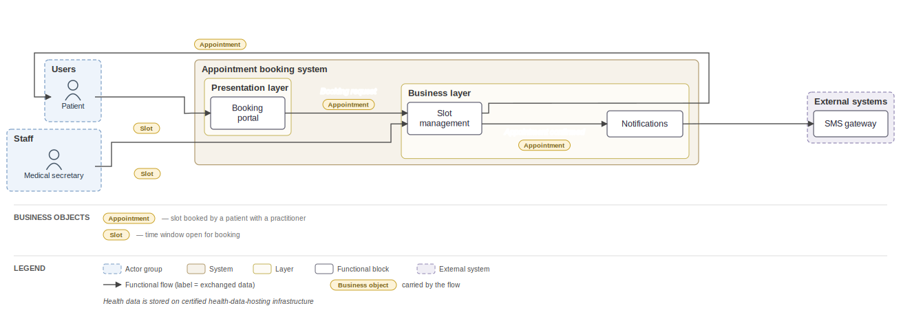
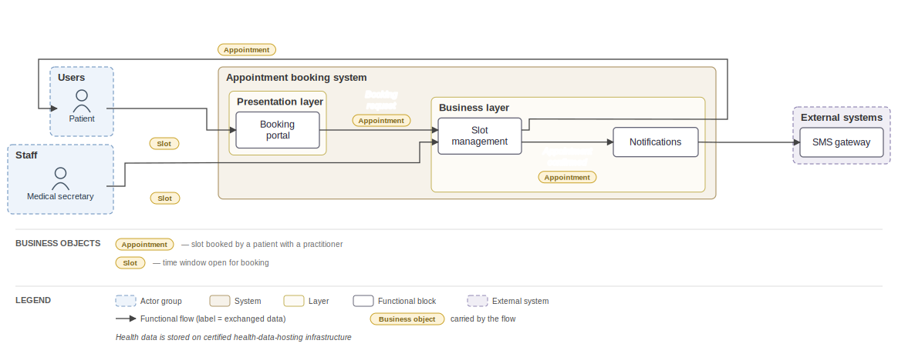
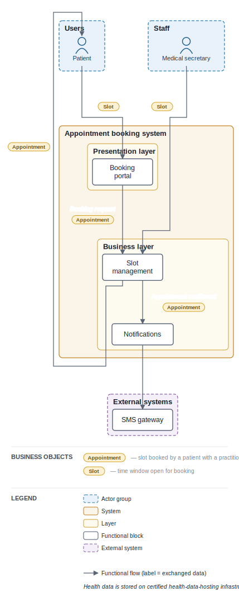
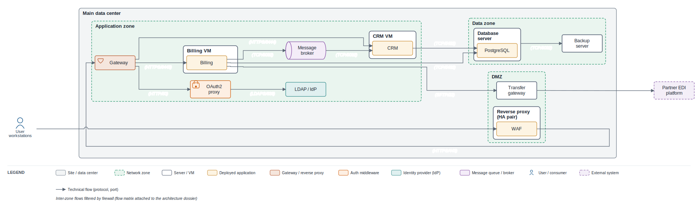
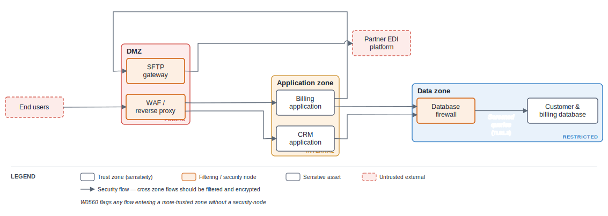

# Cairn, a specialized Software Architecture Diagrams as code tool

*Just as a mountain trail is marked by cairns, software architecture is understood through a series of views, each revealing a different part of the landscape.*

## In short,

Cairn is an [ELK (Eclipse Layout Kernel)](https://github.com/eclipse-elk/elk) based diagram-as-code tool specialised in these four software architecture views : `logical`, `application`, `infrastructure` and `security` with the aim to follow the requirements of the  methodology. This tool  comes with a CLI and a [browser playground](https://cairn-psi-five.vercel.app/), both providing template initializing for each type of diagram, validation, live previous, and export to SVG and PNG format. 

## Why cairn?

A large majority of the diagrams (logical, application, infrastructure view) in existing Software Architecture Documents I've worked are made with graphical diagramming softwares such as Drawio and the like. However, modifying diagrams manually in a GUI take time and migrating to diagram as code has proven complicated since most diagrams are rich and it's hard to preserve the same level of information with other solutions like C4.

Furthermore, complexe software architecture with many flows and component generated with existing diagram-as-code tools end up very large or whith overlapping flow labels making unreadable and therefore not possible to integrate in a techical architecture document that requires specifically a logical view, application, physical & infrastructure view and Cairn is made specially to answer this need by provided the following features : 

| Features | Description |
|---|---|
| **Readability through overlap-checked layout.** | Label space is reserved during layout; overlaps are measured every build and shipped at 0, with a CI gate. Each flow stays a distinct arrow with its own label. Labels can also be numbered, with the full labels displayed in the legend. |
| **Configurable dispositions** | `slide`, `page`, `tall` andd `wide` dispositions available to suit different presentation requirements |
| **Spacial optimization** | Cairn aims to optimize space as much as possible (Still working on improving this functionnality) |
| **Typed diagrams with validation.** | Each view defines its element kinds and rules; `cairn validate` reports syntax, schema, and completeness issues as source-located, coded diagnostics, with a JSON mode for CI. |
| **Security trust-boundary linting.** | The `security` view models trust zones with sensitivity levels (`public`/`internal`/`restricted`/`secret`) and flags flows entering a more-trusted zone without a `security-node` (`W0560`) or missing encryption (`W0561`). |
| **Infrastructure flow matrix.** | `cairn matrix` exports the flow matrice as CSV, Markdown, or SVG. Columns split protocol from port, annotate each endpoint with its network zone, and localise via `style { lang: fr }`. |
| **Enterprise-view extras.** | Business objects on flows, an auto-generated legend, and a numbered-flow table via `flow-text: numbered`. |
| **French or English output.** | `style { lang: fr }` localizes band titles, legend, and matrix headers while keeping keywords English for portable sources (open to adding other languages if you find this usefull) |

> Cairn is not a replacement for general diagram tools; for flowcharts, sequence, or ER diagrams, Mermaid or D2 remain the better fit. For C4-level software-structure modeling, dedicated C4 tools like Structurizr or LikeC4 ([c4model.com](https://c4model.com)) are a mature choice.

As a result here's a comparaison of the same diagram done with D2 (ELK Layout) vs Cairn : 

|D2 (ELK Layout)|Cairn (ELK)|
|---|---|
||
|[Link to D2 playground](https://play.d2lang.com/?script=tFfNbiJHF93zFFd8C28-Ox4n2aAoEgNtB8kDFt0ezYyQULn6AqUUVT11q4mdyO-Tzjpv0C8WVXUDRQM2nig7G7vOPffvnEsqDHIrtOqAEfOFba2YoQ780QJIr865VjMxr34FkOxJ5_Yc1Vwo7ADKX_3HdoFLPBdpB76_vGz5j_4H3TR1fyAEypgVTEJmdIbGCiSwGnRmxVL8jmB0boWad1oAz63nVmuPUOvLaBhNe8n4tuIh2QPKDrRvjM4zXKKykCKY8m-JBOfwRSsEjsoaJrHt6IxHt9F09D6eXr7bZlJhdOf1c66V9RAwUR4hM0JxkXkM94IWLMMOZGhIK__JbyK1iw78eOmZr-PcRAfC3CC5jBQTxgWYaeUzVCgBLVjkCyW-5m-MlES9Xw7ESjwaF6gIUqSJMkikc8OR4Jsye647ECfdZDAantSEWFiEVJBlyroocyPSc65lvlTUgXfbrtwdKtcoKwvDLOYGLBrDhJqoJuLpvHuD97fRLuueeHA88dGWhRGYG6QjLO_jaDy9Hgy7t02Sdz6u8qPD0aiyeK2eP2z651F7o2H_6DwSmpXgCBkjYnM0dPJseOxxFN81scdImVbEHiROlAvxLRWNP8fTXjRMxt3GNg7UzDCyJuc2N7tD1gJwz4aDj1H3PljkoB865wt0efc2e9irVrhdCcqHUX_aG31wr9ePt88_6DSX7vlEcb1c5kpw5vYrkAH3789bqJs4mfa7SfdFLGuYsOvZJki1ck2mPbDe9c00_hy_wssJaW4qXvREtvxzuc8rvh98nF7f3n_aB3svNfeTkYuVcD_IM8atWAlbFhNlcZkRmLJAuQatgYPSx4MkOlL6ar3KItPGlsVO0Ufj_s7LI_lpkwpVp8csSinsfn6uhSdghT2Umh_qoEfqJldvQDpMK76_uxuNk2n3-nrav0v28T4id1JEkJ6x2UzwBZu7BVrXisJ6P7dag-H1uDuNPiXReNiQnfFWifHRolFHZWc46kcOY9of7C9yY9V2aNW47XX3N0DDKNkX2nFZELIcrEBDXhRSMZvlJLQ6jHDVRIhrnUrP8NHVowIJNmUXoze6vY16-1PYSKnOwoNxLaXrAOwBPwenwUVg8nD-MwQ6dbEnPu2tysylfvDj1UDyNv4K0MXO8jtQv-JoQGKw4oc5_nT-OvRa79pdicYi_R-UtmJWzzMB2omayfzRl0as0BCSO7NWqJjirkyN2PXJ8La8uk5lfMTv0rIgtvl1otKzXDmLXgrFZDiI7d2b4SIw-xcyd8pw0RSddizmikmvwy4iU3rJpLsi0YJQXC_KwmCQ7qGYxxMOYq6lya1FyvyF5mJsVsJLyhK9IRO4crtGby7HieIby9oeHq-F3pMfN0eUS4umvWO3L42IC7KjOxfNvW_3N1kEVgHpmVAzbZbVQPl9czd6bh7qDtdZEkgxV0jBsUPtV9mtXfYVelcdaEdePXZ8dsfUfCN8sbc2erw-BwbplIUL3DeoV7NGaGEzBHU5mLK-SJnRfMGEInBrOVHEBLlJzZgBeVYWX3ORhV9O3kD_hJUN6SeGKVoKqueWgsH1pGpOWB97CuVEZcbZgbJAufHX4SkEKxc-SVG2cmb4QqzYvDJpydb1NGJtQGXh_uCd399fqBrnauvIPK0N5t_WK5jC0INqY3LTWBarslCeHrVbL23f24qzw2TTNFeocDM9R1PZt9d_6575HSKdL5ioLpMjtNxVcZomBjrcKBFIBlKQN-Zg8mtHctqcorKOB6Q5rMpiIXh1l4Et_7IuH52b4Iu3-9IndFp9EX5JLk5Wc38etoc7nmkNmwkebrGbunz9Jeu_Hqv6Z6r0jMj7OjAizYXvWLhye7pZnU1knyRe6IxxYZ86cNl6bv0TAAD__w%3D%3D&layout=elk)|[Diagram in Cairn playground](https://cairn-psi-five.vercel.app/#src=ZGlhZ3JhbSBsb2dpY2FsICJTeXN0w6htZSBkZSBjb250csO0bGUgZCdhZmZpY2hhZ2Ug4oCUIHZ1ZSBsb2dpcXVlIgoKCmFjdG9yLWdyb3VwIFpPTkVfQ1RSTCAiR3JvdXBlbWVudCBkZSByw7RsZXMgLSBab25lIGNlbnRyYWxlIiB7CiAgYWN0b3IgT0JTICAiQWdlbnQgZGUgY29udHLDtGxlIFxuWm9uZSBwcmluY2lwYWxlIgogIGFjdG9yIEdFICAgIkdlc3Rpb25uYWlyZSBcbmZvbmN0aW9ubmVsIGV0IHRlY2huaXF1ZSIKICBhY3RvciBURUNIICJUZWNobmljaWVucyBkZXNcbnJlc3NvdXJjZXMgWm9uZSBwcmluY2lwYWxlIgp9CgphY3Rvci1ncm91cCBaT05FX1NUQVRJT04gIkdyb3VwZW1lbnQgZGUgcsO0bGVzIC0gU2l0ZSBkaXN0YW50IiB7CiAgYWN0b3IgT1BFICJPcMOpcmF0ZXVyIHRlcnJhaW5cblNpdGUgZGlzdGFudCIKfQoKYWN0b3ItZ3JvdXAgWk9ORV9DSUJMRSAiQ2libGVzIGV4dMOpcmlldXJlcyIgewogIGFjdG9yIFVTRVJfRklOQUwgIlBlcnNvbm5lIGNvbmNlcm7DqWUiCiAgYWN0b3IgVVNFUl9DT05EICJBZ2VudCBkZSBzZXJ2aWNlIHBhc3NhZ2VycyIKICBhY3RvciBVU0VSX1JFU1AgIlJlc3BvbnNhYmxlXG5kZSBzaXRlIGRpc3RhbnQiCn0KCnN5c3RlbSBDRU5UUkFMICJJbmZyYXN0cnVjdHVyZSBwcmluY2lwYWxlIiB7CiAgbGF5ZXIgQ1RSTCAiQ291Y2hlIGRlIENvbnRyw7RsZSBDZW50cmFsIiB7CiAgICBibG9jayBDT01fQ1RSICAgIk1vZHVsZSBkZVxuY29tbXVuaWNhdGlvbiBjZW50cmFsZSIKICAgIGJsb2NrIEdTVF9EQVRBICAiTW9kdWxlIGRlXG50cmFpdGVtZW50IGRlcyBkb25uw6llcyIKICAgIGJsb2NrIENGR19TWVMgICAiTW9kdWxlIGRlXG5jb25maWd1cmF0aW9uIHN5c3TDqG1lIgogICAgYmxvY2sgU1VJVl9GTFVYICJCbG9jIGRlIHN1aXZpIGRlIGwnYWN0aXZpdMOpXG50ZW1wcyByw6llbCIKICB9CiAgbGF5ZXIgU0lURSAiQ291Y2hlIFNpdGUgZMOpcG9ydMOpIiB7CiAgICBibG9jayBDT09SRF9TSVRFICJNb2R1bGUgZGVcbmNvb3JkaW5hdGlvbiBzYXRlbGxpdGUiCiAgICBibG9jayBDT01fU0lURSAgICJNb2R1bGUgZGVcbmNvbW11bmljYXRpb24gbG9jYWxlIgogICAgYmxvY2sgQ09NX1NBVDIgICAiTW9kdWxlIGRlXG5jb21tdW5pY2F0aW9uIHNhdGVsbGl0ZSIKICAgIGJsb2NrIEFGRl9EUFQgICAgIlZlY3RldXJzIGQnYWZmaWNoYWdlXG5kw6lwb3J0w6lzIgogIH0KfQoKZXh0ZXJuYWwgRVhUICJSZXNzb3VyY2VzIGV4dGVybmVzIiB7CiAgYmxvY2sgRVhUX0RJU1AgICAgICJJbmZyYXN0cnVjdHVyZSBkJ2FmZmljaGFnZVxuZXh0ZXJuZSIKICBibG9jayBFWFRfTkVUMDEgICAgIlLDqXNlYXUgdGllcnNcbmRlIGRpZmZ1c2lvbiIKICBibG9jayBFWFRfTkVUMDIgICAgIlNlcnZpY2UgZCdleHBvcnRcbmRlIGRvbm7DqWVzIgogIGJsb2NrIEVYVF9DT0xMRUNURSAiSW5mcmFzdHJ1Y3R1cmUgZXh0ZXJuZVxuZGUgY29sbGVjdGUgZGUgZG9ubsOpZXMiCn0KCiMgLS0tLSBmbHV4IC0tLS0KT0JTICAgICAgICAgIC0+IENUUkwgICAgICAgOiAiQ29udHLDtGxlIGdsb2JhbGUiCkdFICAgICAgICAgICAtPiBDRkdfU1lTICAgIDogIkNvbmZpZ3VyZXIgbGUgc3lzdMOobWUiCkNPTV9DVFIgICAgICAtPiBPQlMgICAgICAgIDogIkFsZXJ0ZXMsIG5vdGlmaWNhdGlvbnMgZXRcbmZsdXggZGUgZGl2ZXJzZXMgcHJvdmVuYW5jZXMiClRFQ0ggICAgICAgICAtPiBDRkdfU1lTICAgIDogIkFjdGl2YXRpb24vZMOpc2FjdGl2YXRpb25cbmQndW4gdGVybWluYWwgZCdhZmZpY2hhZ2UiCgpDT09SRF9TSVRFICAgLT4gT1BFICAgICAgICA6ICJTaWduYWxlbWVudFxuZCdhbm9tYWxpZXMgZXQgaW5jb2jDqXJlbmNlcyIKT1BFICAgICAgICAgIC0+IENPTV9TSVRFICAgOiAiUsOpZGFjdGlvbiBldCBkaWZmdXNpb24gZGVcbm1lc3NhZ2VzIHZlcnMgbGUgY29udHLDtGxlXG5jZW50cmFsIgoKWk9ORV9DSUJMRSAgIC0+IEFGRl9EUFQgICAgOiAiQ29uc3VsdGVyIgoKQ09NX0NUUiAgICAgIC0+IEVYVF9ORVQwMSAgOiAiRGlmZnVzaW9uIHRlbXBzIHLDqWVsIGQnaW5mb3JtYXRpb25zXG5kZSBwZXJ0dXJiYXRpb25cbnZlcnMgbGVzIGxpZ25lcyBjb25jZXJuw6llcyIKR1NUX0RBVEEgICAgIC0+IEVYVF9ORVQwMiAgOiAiRXhwb3J0IGRlcyBkb25uw6llc1xudGVtcHMgcsOpZWwgZXQgZGUgY29uZmlndXJhdGlvbiIKClNVSVZfRkxVWCAgICAtPiBDT09SRF9TSVRFIDogIkRpZmZ1c2lvbiBkJ2luZm9ybWF0aW9uc1xuZXQgbWVzc2FnZXMgY29uY2VybmFudCBsZXMgcHJvY2hhaW5zIGZsdXhcbnNhaXNpZXMgcGFyIGwnw6lxdWlwZSBjZW50cmFsZSIKQ09PUkRfU0lURSAgIC0+IFNVSVZfRkxVWCAgOiAiVHJhbnNtaXNzaW9uIGRlc1xubWVzc2FnZXMgc2Fpc2lzIHBhciBsZSBwZXJzb25uZWxcbnByw6lzZW50IHN1ciBzaXRlIgpDT01fU0FUMiAgICAgLT4gQ09NX0NUUiAgICA6ICJBcmNoaXZhZ2UgZGVcbmxhIG1lc3NhZ2VyaWUgZGlmZnVzw6llXG5sb2NhbGVtZW50IGVuIHNpdGUgZGlzdGFudCIKCkVYVF9DT0xMRUNURSAtPiBTVUlWX0ZMVVggIDogIlRyYW5zbWlzc2lvbiBkZXMgZG9ubsOpZXNcbmRlIGNvbGxlY3RlIGV4dGVybmUgZXQgw6l2w6luZW1lbnRzIgpFWFRfTkVUMDEgICAgLT4gQ09NX0NUUiAgICA6ICJUcmFuc21pc3Npb24gbWVzc2FnZXMgZGVcbnBlcnR1cmJhdGlvbiBkZXMgcsOpc2VhdXggZGUgdHJhbnNwb3J0IHNvdWhhaXTDqXMiCkVYVF9ESVNQICAgICAtPiBDT09SRF9TSVRFIDogIlRyYW5zbWlzc2lvbiBkZSBsYSBsaXN0ZSBkZXMgcHJvY2hhaW5zXG5mbHV4IGV0IGlkZW50aXTDqSBkdSB2w6loaWN1bGUgZGUgdMOqdGVcbnBvdXIgY29udHLDtGxlIHDDqXJpb2RpcXVlIgpFWFRfTkVUMDIgICAgLT4gQ09NX1NBVDIgICA6ICJOb3RpZmljYXRpb25zIHRyYWZpY1xuZXQgbWVzc2FnZXJpZSB1c2FnZXJzIgpFWFRfQ09MTEVDVEUgLT4gU1VJVl9GTFVYICA6ICJUcmFuc21pc3Npb24gZGVzIG1pc3Npb25zIGV0IGRlc3NlcnRlcyBhc3NvY2nDqXMiCg==)
|I encoutered overlapping issues for which I couldn't find a workaround|The overlapping issues have been adressed. A caveat remains, the long-distance arrow can effect readability (still working on improvements)|

## Usage & preview

Either use the cli or the [ playground](https://cairn-psi-five.vercel.app/).

Every image below is rendered by cairn CLI from a `.cairn` source in [`examples/`](examples/) — plain SVG, zero label overlaps.

### Small

A minimal logical view (default `wide` disposition, light theme) — [`examples/small.cairn`](examples/small.cairn):

<p align="center"></p>

### Medium

More systems, layers and flows — [`examples/medium.cairn`](examples/medium.cairn):

<p align="center"></p>

### Light mode / dark mode

The same diagram under each theme — `style { theme: light }` (default) vs `style { theme: dark }`. Switching the one line re-colors background, nodes, text, arrows, chips and legend together:

<table> <tr> <td width="50%"><br><sub><code>theme: light</code> — <a href="examples/theme-light.cairn">theme-light.cairn</a></sub></td> <td width="50%"><br><sub><code>theme: dark</code> — <a href="examples/theme-dark.cairn">theme-dark.cairn</a></sub></td> </tr> </table>

### Custom colours

Per-element `fill`/`stroke`/`text`, per-kind overrides, and a custom canvas `background` — [`examples/colors-custom.cairn`](examples/colors-custom.cairn):

<p align="center"></p>

### Dispositions — wide / slide / tall

One `style { disposition: … }` line sets the shape. `wide` is the default horizontal flow, `slide` fits a hard 16:9 landscape, `tall` runs top-to-bottom — same source, three fits:

<table> <tr> <td align="center"><br><sub><b>wide</b> · 1524×496</sub></td> <td align="center"><br><sub><b>slide</b> · 16:9 fit</sub></td> <td align="center" width="22%"><br><sub><b>tall</b> · 431×1240</sub></td> </tr> </table>

(A fourth disposition, `page`, fits an A4 portrait — see [`examples/dispositions/`](examples/dispositions/) for the full view × size × disposition matrix.)

### Diagram types

Four built-in enterprise-architecture views — each with its own element kinds, validation rules, and layout conventions — from a single DSL:

<table>
<tr>
  <td width="50%"><br><sub><strong>Logical</strong> — actors, systems, layers, functional blocks and labelled flows — <a href="examples/logical.cairn">logical.cairn</a></sub></td>
  <td width="50%"><br><sub><strong>Application</strong> — applications, modules, datastores and <code>(protocol, format)</code> on inter-system flows — <a href="examples/application.cairn">application.cairn</a></sub></td>
</tr>
<tr>
  <td width="50%"><br><sub><strong>Infrastructure</strong> — sites, network zones, servers, app-instances; protocol required — <a href="examples/infrastructure.cairn">infrastructure.cairn</a></sub></td>
  <td width="50%"><br><sub><strong>Security</strong> — trust zones (with sensitivity levels), security nodes, assets; boundary-crossing lint — <a href="examples/security.cairn">security.cairn</a></sub></td>
</tr>
</table>

## Install

```bash
# While in early access / local development:
git clone [https://github.com/R0kshan/cairn](https://github.com/R0kshan/cairn)
cd cairn
npm install
npm run cairn -- --help

# Coming soon: Homebrew, Scoop, and npm i -g cairn-cli
```

## Commands

Once installed, the command is `cairn`. From a clone, run `npm run cairn -- <command>`.

### Scaffold a typed starter file

```sh
cairn new -L my-system.cairn        # -L logical · -A application · -I infrastructure · -S security
```

The chosen view is written into the file header (`diagram logical …`); every other command reads it from there.

### Check a diagram (syntax, schema, completeness)

```sh
cairn validate my-system.cairn      # --format json for CI/agents · --strict to fail on warnings
```

Problems are reported as source-located, coded diagnostics with a suggested fix:

```text
error[E0210]: functional block outside any system (`ORPHAN`)
 --> my-system.cairn:8:7
  |
8 | block ORPHAN "Floating block"
  |       ^^^^^^
help: move this `block` inside a `layer`, `system` or `external`
```

### Render to SVG

```sh
cairn build my-system.cairn -o my-system.svg     # -o optional; defaults to the same name, .svg
```

On validation errors nothing is written and the exit code is 1; warnings are printed but do not block.

### Export the flow matrix (matrice des flux techniques)

```sh
cairn matrix my-infra.cairn --format csv    # csv (default) | md | svg · -o to set the path
```

### Rebuild on every save

```sh
cairn watch my-system.cairn
```

Rebuilds the SVG on save. On a compile error the SVG becomes an error panel (codes, lines, help), so an open preview never shows a stale diagram. Watch observes only the file it was launched on — run one per file. Pair it with an editor that auto-refreshes an open SVG.

### Explain a diagnostic

```sh
cairn explain E0240
```

```text
E0240 — The infrastructure view requires every flow to carry its protocol (and port if
relevant): the flow matrix is the primary output of this view. Add `(HTTPS/443)` after the label.
```

Exit codes across commands: `0` clean or warnings-only · `1` errors (or warnings with `--strict`) · `2` usage/file problems. Full code list: [`DIAGNOSTICS.md`](documentation/DIAGNOSTICS.md).

## Examples & dispositions

A diagram chooses its shape with one line in a `style` block:

```
diagram logical "Online appointment booking — logical view"
style { disposition: slide }     # wide | tall | slide | page
…
```

The four dispositions trade orientation for fit:

- **wide** (default) — elongated horizontal; actors on the left, external systems on the right.
- **tall** — elongated vertical; actors on top, externals at the bottom.
- **slide** — hard 16:9 landscape, scaled to fill a 1280×720 slide.
- **page** — hard A4 portrait, scaled to fill a Word/ODT page.

For `slide` and `page`, cairn evaluates oriented candidates (both directions, wrapped labels, tight spacing) and keeps the one with the largest readable text, reporting the fit it achieved:

```sh
cairn build examples/small.cairn
cairn build examples/dispositions/small-tall.cairn
cairn build examples/dispositions/small-slide.cairn
cairn build examples/dispositions/small-page.cairn
```

When a view is too large for one slide, cairn reports it rather than shrinking the text below a readable size:

```sh
cairn build examples/dispositions/large-slide.cairn
```

## Colors & themes

Every element's colors are customizable — `fill`, `stroke`, and `text` (label color) — inline per element, per kind, or per diagram, plus the canvas `background`. A `theme` switch picks the palette: `light` (default) or a built-in `dark` range tuned to match.

```
diagram logical "…"
style {
  theme: dark              # light (default) | dark
  background: #0d1117      # optional canvas override
}

system CORE "Core system" {
  block API "API gateway" { style { fill: #e8f5e9  stroke: #2e7d32  text: #1b5e20 } }
}
```

Both themes ship coherent per-kind defaults, so `style { theme: dark }` on its own re-colors the whole diagram — background, nodes, text, arrows, chips, legend and bands — with no label overlaps:

```sh
cairn build examples/theme-dark.cairn       # dark palette
cairn build examples/colors-custom.cairn    # per-element colors + custom background
```


## More

- [`DIAGNOSTICS.md`](documentation/DIAGNOSTICS.md) — every diagnostic code and its meaning.
- [`DSL_SPEC.md`](documentation/DSL_SPEC.md) — the DSL syntax.
- [`DESIGN_BRIEF.md`](documentation/DESIGN_BRIEF.md) — design rationale and architecture overview.
- [`research/`](documentation/research/) — layout engine evaluation, comparison results, alternatives analysis.