# Cairn, a specialized Software Architecture Diagram as Code tool

*Just as a mountain trail is marked by cairns, software architecture is understood through a series of views, each revealing a different part of the landscape.*

## In short,

Cairn is an [Elkjs (Eclipse Layout Kernel)](https://github.com/kieler/elkjs) based diagram-as-code tool specialised in these three software architecture views : `logical`, `application` and `infrastructure`, with the aim to follow the requirements of the  methodology. This tool  comes with a CLI and a [browser playground](https://cairn-psi-five.vercel.app/), both providing template initializing for each type of diagram, validation, live previous, and export to SVG and PNG format. 

## Status

**Ongoing development** - Pre-releases are available. Stable version will be release when all opened issues are resolved.

## Table of contents

- [Why cairn?](#why-cairn)
- [Usage](#usage)
- [Preview](#preview)
- [Installation](#installation)
- [Commands](#commands)
- [More](#more)

## Why cairn?

A large majority of the diagrams (logical, application, infrastructure view) in existing Software Architecture Documents I've worked are made with graphical diagramming softwares such as Drawio and the like. However, modifying diagrams manually in a GUI despite providing more control on the display, take time and migrating to diagram as code has proven complicated since most diagrams are rich and it's hard to preserve the same level of information with other solutions like C4.

Furthermore, complexe software architecture with many flows and component generated with existing diagram-as-code tools end up very large or with overlapping flow labels making them unreadable and therefore not possible to integrate in a techical architecture document that requires specifically a logical view, application, physical & infrastructure view and Cairn is made specially to answer this need by provided the following features : 

| Features | Description |
|---|---|
| **Readability through overlap-checked layout.** | Label space is reserved during layout; overlaps are measured every build and shipped at 0, with a CI gate. Each flow stays a distinct arrow with its own label. Labels can also be numbered, with the full labels displayed in the legend. |
| **Configurable dispositions** | `slide` and `page` dispositions available to suit different presentation requirements |
| **Spacial optimization** | Cairn aims to optimize space as much as possible (Still working on improving this functionnality) |
| **Typed diagrams with validation.** | Each view defines its element kinds and rules; `cairn validate` reports syntax, schema, and completeness issues as source-located, coded diagnostics, with a JSON mode for CI. |
| **Flow matrix.** | `cairn matrix` exports the flow matrix as CSV, Markdown, or SVG — from any view, with the columns that view can fill. In infrastructure it splits protocol from port and annotates endpoints that sit in a network zone; headers localise via `style { lang: fr }`. The same table is available to embedders through `compile(source, { matrix: true })`. |
| **Author-controlled positioning.** | Layout is automatic, with three opt-in overrides for when it gets a diagram wrong: `order: 2` sequences a top-level element along the disposition's own reading direction (left to right in `wide`, top to bottom in `tall`) and sorts siblings inside a container, `A.right -> B.left` pins which side of an element a flow leaves and arrives on, and the arrow glyph carries the line style (`->` solid, `-->` dashed, `..>` dotted). A pin the layout cannot honor is reported (`W0570`), never silently dropped. |
| **Enterprise-view extras.** | Business objects on flows, an auto-generated legend, and a numbered-flow table via `flow-text: numbered`. |
| **French or English output.** | `style { lang: fr }` localizes band titles, legend, and matrix headers while keeping keywords English for portable sources (open to adding other languages if you find this usefull) |
| **In-built themes and customizable colours** | Whether using the default or a chosen in-built theme, element colours can be overriden  for all elements of a given kind in the `style` block |

> Cairn is not a replacement for general diagram tools; for flowcharts, sequence, or ER diagrams, Mermaid or D2 remain the better fit. For C4-level software-structure modeling, dedicated C4 tools like Structurizr or LikeC4 ([c4model.com](https://c4model.com)) are a mature choice.

As a result here's a comparaison of the same diagram done with D2 (ELK Layout) vs Cairn (tuned ELK Layout) : 

<table>
  <tr>
    <td align="center" width="50%"><strong>D2 (ELK Layout)</strong></td>
    <td align="center" width="50%"><strong>Cairn (ELK)</strong></td>
  </tr>
  <tr>
    <td align="center">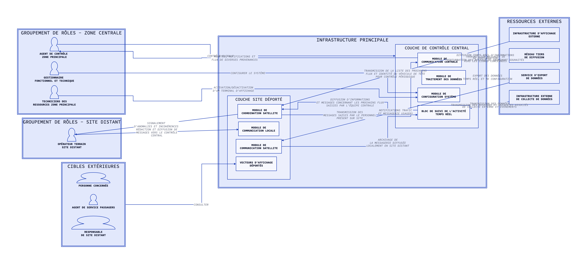</td>
    <td align="center">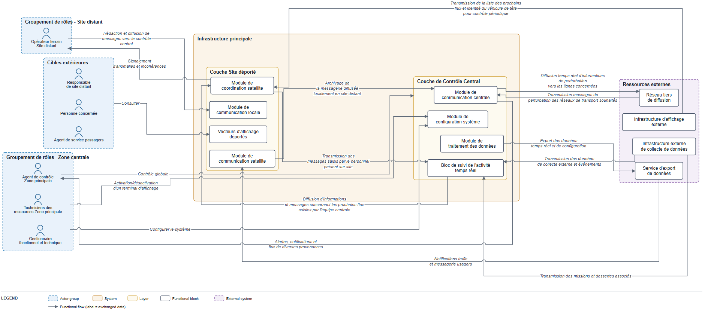</td>
  </tr>
  <tr>
      <td align="center"><a href="https://play.d2lang.com/?script=tFfNbiJHF93zFFd8C28-Ox4n2aAoEgNtB8kDFt0ezYyQULn6AqUUVT11q4mdyO-Tzjpv0C8WVXUDRQM2nig7G7vOPffvnEsqDHIrtOqAEfOFba2YoQ780QJIr865VjMxr34FkOxJ5_Yc1Vwo7ADKX_3HdoFLPBdpB76_vGz5j_4H3TR1fyAEypgVTEJmdIbGCiSwGnRmxVL8jmB0boWad1oAz63nVmuPUOvLaBhNe8n4tuIh2QPKDrRvjM4zXKKykCKY8m-JBOfwRSsEjsoaJrHt6IxHt9F09D6eXr7bZlJhdOf1c66V9RAwUR4hM0JxkXkM94IWLMMOZGhIK__JbyK1iw78eOmZr-PcRAfC3CC5jBQTxgWYaeUzVCgBLVjkCyW-5m-MlES9Xw7ESjwaF6gIUqSJMkikc8OR4Jsye647ECfdZDAantSEWFiEVJBlyroocyPSc65lvlTUgXfbrtwdKtcoKwvDLOYGLBrDhJqoJuLpvHuD97fRLuueeHA88dGWhRGYG6QjLO_jaDy9Hgy7t02Sdz6u8qPD0aiyeK2eP2z651F7o2H_6DwSmpXgCBkjYnM0dPJseOxxFN81scdImVbEHiROlAvxLRWNP8fTXjRMxt3GNg7UzDCyJuc2N7tD1gJwz4aDj1H3PljkoB865wt0efc2e9irVrhdCcqHUX_aG31wr9ePt88_6DSX7vlEcb1c5kpw5vYrkAH3789bqJs4mfa7SfdFLGuYsOvZJki1ck2mPbDe9c00_hy_wssJaW4qXvREtvxzuc8rvh98nF7f3n_aB3svNfeTkYuVcD_IM8atWAlbFhNlcZkRmLJAuQatgYPSx4MkOlL6ar3KItPGlsVO0Ufj_s7LI_lpkwpVp8csSinsfn6uhSdghT2Umh_qoEfqJldvQDpMK76_uxuNk2n3-nrav0v28T4id1JEkJ6x2UzwBZu7BVrXisJ6P7dag-H1uDuNPiXReNiQnfFWifHRolFHZWc46kcOY9of7C9yY9V2aNW47XX3N0DDKNkX2nFZELIcrEBDXhRSMZvlJLQ6jHDVRIhrnUrP8NHVowIJNmUXoze6vY16-1PYSKnOwoNxLaXrAOwBPwenwUVg8nD-MwQ6dbEnPu2tysylfvDj1UDyNv4K0MXO8jtQv-JoQGKw4oc5_nT-OvRa79pdicYi_R-UtmJWzzMB2omayfzRl0as0BCSO7NWqJjirkyN2PXJ8La8uk5lfMTv0rIgtvl1otKzXDmLXgrFZDiI7d2b4SIw-xcyd8pw0RSddizmikmvwy4iU3rJpLsi0YJQXC_KwmCQ7qGYxxMOYq6lya1FyvyF5mJsVsJLyhK9IRO4crtGby7HieIby9oeHq-F3pMfN0eUS4umvWO3L42IC7KjOxfNvW_3N1kEVgHpmVAzbZbVQPl9czd6bh7qDtdZEkgxV0jBsUPtV9mtXfYVelcdaEdePXZ8dsfUfCN8sbc2erw-BwbplIUL3DeoV7NGaGEzBHU5mLK-SJnRfMGEInBrOVHEBLlJzZgBeVYWX3ORhV9O3kD_hJUN6SeGKVoKqueWgsH1pGpOWB97CuVEZcbZgbJAufHX4SkEKxc-SVG2cmb4QqzYvDJpydb1NGJtQGXh_uCd399fqBrnauvIPK0N5t_WK5jC0INqY3LTWBarslCeHrVbL23f24qzw2TTNFeocDM9R1PZt9d_6575HSKdL5ioLpMjtNxVcZomBjrcKBFIBlKQN-Zg8mtHctqcorKOB6Q5rMpiIXh1l4Et_7IuH52b4Iu3-9IndFp9EX5JLk5Wc38etoc7nmkNmwkebrGbunz9Jeu_Hqv6Z6r0jMj7OjAizYXvWLhye7pZnU1knyRe6IxxYZ86cNl6bv0TAAD__w%3D%3D&layout=elk">Link to D2 playground</a>
      </td>
      <td align="center"><a href="https://cairn-psi-five.vercel.app/#src=ZGlhZ3JhbSBsb2dpY2FsICJTeXN0w6htZSBkZSBjb250csO0bGUgZCdhZmZpY2hhZ2Ug4oCUIHZ1ZSBsb2dpcXVlIgoKCmFjdG9yLWdyb3VwIFpPTkVfQ1RSTCAiR3JvdXBlbWVudCBkZSByw7RsZXMgLSBab25lIGNlbnRyYWxlIiB7CiAgYWN0b3IgT0JTICAiQWdlbnQgZGUgY29udHLDtGxlIFxuWm9uZSBwcmluY2lwYWxlIgogIGFjdG9yIEdFICAgIkdlc3Rpb25uYWlyZSBcbmZvbmN0aW9ubmVsIGV0IHRlY2huaXF1ZSIKICBhY3RvciBURUNIICJUZWNobmljaWVucyBkZXNcbnJlc3NvdXJjZXMgWm9uZSBwcmluY2lwYWxlIgp9CgphY3Rvci1ncm91cCBaT05FX1NUQVRJT04gIkdyb3VwZW1lbnQgZGUgcsO0bGVzIC0gU2l0ZSBkaXN0YW50IiB7CiAgYWN0b3IgT1BFICJPcMOpcmF0ZXVyIHRlcnJhaW5cblNpdGUgZGlzdGFudCIKfQoKYWN0b3ItZ3JvdXAgWk9ORV9DSUJMRSAiQ2libGVzIGV4dMOpcmlldXJlcyIgewogIGFjdG9yIFVTRVJfRklOQUwgIlBlcnNvbm5lIGNvbmNlcm7DqWUiCiAgYWN0b3IgVVNFUl9DT05EICJBZ2VudCBkZSBzZXJ2aWNlIHBhc3NhZ2VycyIKICBhY3RvciBVU0VSX1JFU1AgIlJlc3BvbnNhYmxlXG5kZSBzaXRlIGRpc3RhbnQiCn0KCnN5c3RlbSBDRU5UUkFMICJJbmZyYXN0cnVjdHVyZSBwcmluY2lwYWxlIiB7CiAgbGF5ZXIgQ1RSTCAiQ291Y2hlIGRlIENvbnRyw7RsZSBDZW50cmFsIiB7CiAgICBibG9jayBDT01fQ1RSICAgIk1vZHVsZSBkZVxuY29tbXVuaWNhdGlvbiBjZW50cmFsZSIKICAgIGJsb2NrIEdTVF9EQVRBICAiTW9kdWxlIGRlXG50cmFpdGVtZW50IGRlcyBkb25uw6llcyIKICAgIGJsb2NrIENGR19TWVMgICAiTW9kdWxlIGRlXG5jb25maWd1cmF0aW9uIHN5c3TDqG1lIgogICAgYmxvY2sgU1VJVl9GTFVYICJCbG9jIGRlIHN1aXZpIGRlIGwnYWN0aXZpdMOpXG50ZW1wcyByw6llbCIKICB9CiAgbGF5ZXIgU0lURSAiQ291Y2hlIFNpdGUgZMOpcG9ydMOpIiB7CiAgICBibG9jayBDT09SRF9TSVRFICJNb2R1bGUgZGVcbmNvb3JkaW5hdGlvbiBzYXRlbGxpdGUiCiAgICBibG9jayBDT01fU0lURSAgICJNb2R1bGUgZGVcbmNvbW11bmljYXRpb24gbG9jYWxlIgogICAgYmxvY2sgQ09NX1NBVDIgICAiTW9kdWxlIGRlXG5jb21tdW5pY2F0aW9uIHNhdGVsbGl0ZSIKICAgIGJsb2NrIEFGRl9EUFQgICAgIlZlY3RldXJzIGQnYWZmaWNoYWdlXG5kw6lwb3J0w6lzIgogIH0KfQoKZXh0ZXJuYWwgRVhUICJSZXNzb3VyY2VzIGV4dGVybmVzIiB7CiAgYmxvY2sgRVhUX0RJU1AgICAgICJJbmZyYXN0cnVjdHVyZSBkJ2FmZmljaGFnZVxuZXh0ZXJuZSIKICBibG9jayBFWFRfTkVUMDEgICAgIlLDqXNlYXUgdGllcnNcbmRlIGRpZmZ1c2lvbiIKICBibG9jayBFWFRfTkVUMDIgICAgIlNlcnZpY2UgZCdleHBvcnRcbmRlIGRvbm7DqWVzIgogIGJsb2NrIEVYVF9DT0xMRUNURSAiSW5mcmFzdHJ1Y3R1cmUgZXh0ZXJuZVxuZGUgY29sbGVjdGUgZGUgZG9ubsOpZXMiCn0KCiMgLS0tLSBmbHV4IC0tLS0KT0JTICAgICAgICAgIC0+IENUUkwgICAgICAgOiAiQ29udHLDtGxlIGdsb2JhbGUiCkdFICAgICAgICAgICAtPiBDRkdfU1lTICAgIDogIkNvbmZpZ3VyZXIgbGUgc3lzdMOobWUiCkNPTV9DVFIgICAgICAtPiBPQlMgICAgICAgIDogIkFsZXJ0ZXMsIG5vdGlmaWNhdGlvbnMgZXRcbmZsdXggZGUgZGl2ZXJzZXMgcHJvdmVuYW5jZXMiClRFQ0ggICAgICAgICAtPiBDRkdfU1lTICAgIDogIkFjdGl2YXRpb24vZMOpc2FjdGl2YXRpb25cbmQndW4gdGVybWluYWwgZCdhZmZpY2hhZ2UiCgpDT09SRF9TSVRFICAgLT4gT1BFICAgICAgICA6ICJTaWduYWxlbWVudFxuZCdhbm9tYWxpZXMgZXQgaW5jb2jDqXJlbmNlcyIKT1BFICAgICAgICAgIC0+IENPTV9TSVRFICAgOiAiUsOpZGFjdGlvbiBldCBkaWZmdXNpb24gZGVcbm1lc3NhZ2VzIHZlcnMgbGUgY29udHLDtGxlXG5jZW50cmFsIgoKWk9ORV9DSUJMRSAgIC0+IEFGRl9EUFQgICAgOiAiQ29uc3VsdGVyIgoKQ09NX0NUUiAgICAgIC0+IEVYVF9ORVQwMSAgOiAiRGlmZnVzaW9uIHRlbXBzIHLDqWVsIGQnaW5mb3JtYXRpb25zXG5kZSBwZXJ0dXJiYXRpb25cbnZlcnMgbGVzIGxpZ25lcyBjb25jZXJuw6llcyIKR1NUX0RBVEEgICAgIC0+IEVYVF9ORVQwMiAgOiAiRXhwb3J0IGRlcyBkb25uw6llc1xudGVtcHMgcsOpZWwgZXQgZGUgY29uZmlndXJhdGlvbiIKClNVSVZfRkxVWCAgICAtPiBDT09SRF9TSVRFIDogIkRpZmZ1c2lvbiBkJ2luZm9ybWF0aW9uc1xuZXQgbWVzc2FnZXMgY29uY2VybmFudCBsZXMgcHJvY2hhaW5zIGZsdXhcbnNhaXNpZXMgcGFyIGwnw6lxdWlwZSBjZW50cmFsZSIKQ09PUkRfU0lURSAgIC0+IFNVSVZfRkxVWCAgOiAiVHJhbnNtaXNzaW9uIGRlc1xubWVzc2FnZXMgc2Fpc2lzIHBhciBsZSBwZXJzb25uZWxcbnByw6lzZW50IHN1ciBzaXRlIgpDT01fU0FUMiAgICAgLT4gQ09NX0NUUiAgICA6ICJBcmNoaXZhZ2UgZGVcbmxhIG1lc3NhZ2VyaWUgZGlmZnVzw6llXG5sb2NhbGVtZW50IGVuIHNpdGUgZGlzdGFudCIKCkVYVF9DT0xMRUNURSAtPiBTVUlWX0ZMVVggIDogIlRyYW5zbWlzc2lvbiBkZXMgZG9ubsOpZXNcbmRlIGNvbGxlY3RlIGV4dGVybmUgZXQgw6l2w6luZW1lbnRzIgpFWFRfTkVUMDEgICAgLT4gQ09NX0NUUiAgICA6ICJUcmFuc21pc3Npb24gbWVzc2FnZXMgZGVcbnBlcnR1cmJhdGlvbiBkZXMgcsOpc2VhdXggZGUgdHJhbnNwb3J0IHNvdWhhaXTDqXMiCkVYVF9ESVNQICAgICAtPiBDT09SRF9TSVRFIDogIlRyYW5zbWlzc2lvbiBkZSBsYSBsaXN0ZSBkZXMgcHJvY2hhaW5zXG5mbHV4IGV0IGlkZW50aXTDqSBkdSB2w6loaWN1bGUgZGUgdMOqdGVcbnBvdXIgY29udHLDtGxlIHDDqXJpb2RpcXVlIgpFWFRfTkVUMDIgICAgLT4gQ09NX1NBVDIgICA6ICJOb3RpZmljYXRpb25zIHRyYWZpY1xuZXQgbWVzc2FnZXJpZSB1c2FnZXJzIgpFWFRfQ09MTEVDVEUgLT4gU1VJVl9GTFVYICA6ICJUcmFuc21pc3Npb24gZGVzIG1pc3Npb25zIGV0IGRlc3NlcnRlcyBhc3NvY2nDqXMiCg==">Diagram in Cairn playground</a></td>
    </tr>
    <tr>
      <td>I encountered overlapping issues for which I couldn't find a workaround</td>
      <td>The overlapping labels have been addressed.</td>
    </tr>
    </table>

## Usage

Either use the cli or the [ playground](https://cairn-psi-five.vercel.app/).

## Preview

Every image below is rendered by cairn CLI from a `.cairn` source in [`examples/`](examples/) — plain SVG, zero label overlaps.

> The example diagrams have been generated with AI and some of them purposely large to showcase how such diagrams are rendered with Cairn to handle overlap. 

### Logicial view diagram examples from small to large

<p align="center">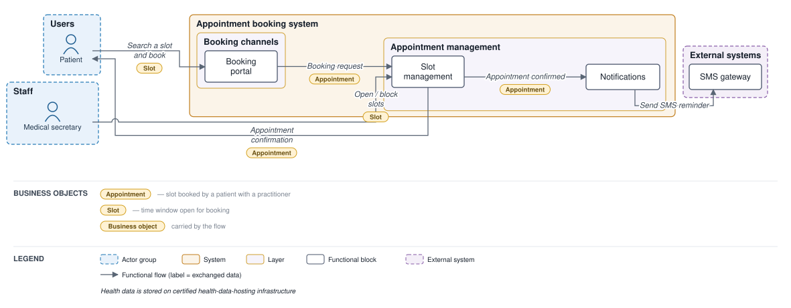</p>
<p align="center">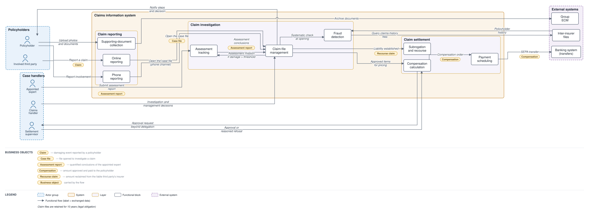</p>
<p align="center">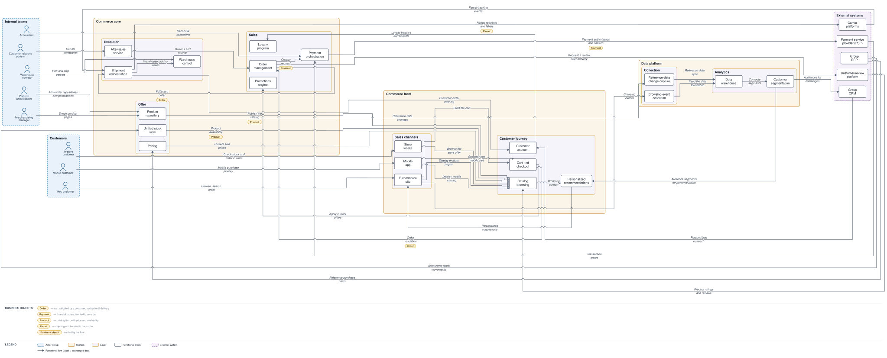</p>

### Application view diagram examples from small to large

<p align="center">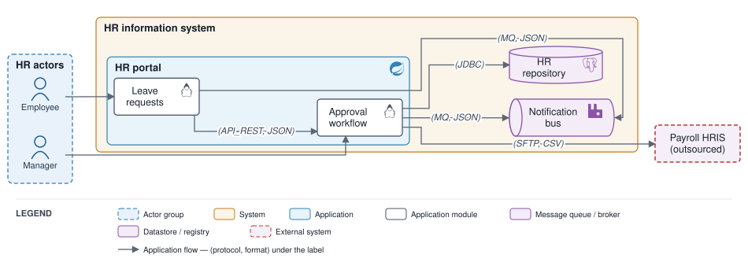</p>
<p align="center">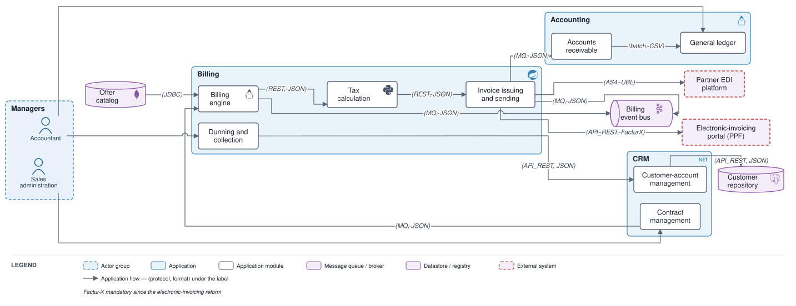</p>
<p align="center">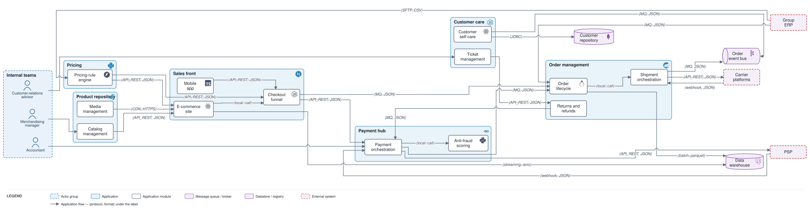</p>

### Infrastructure view diagram examples from small to large

<p align="center">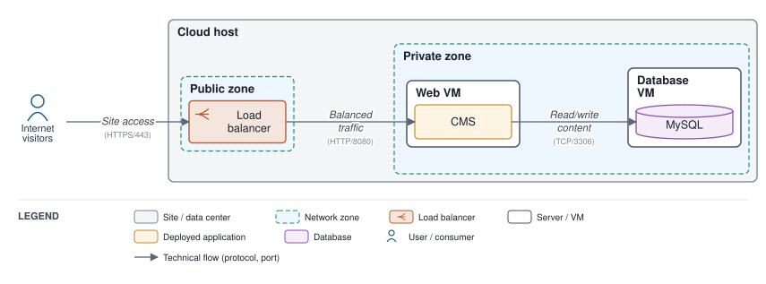</p>
<p align="center">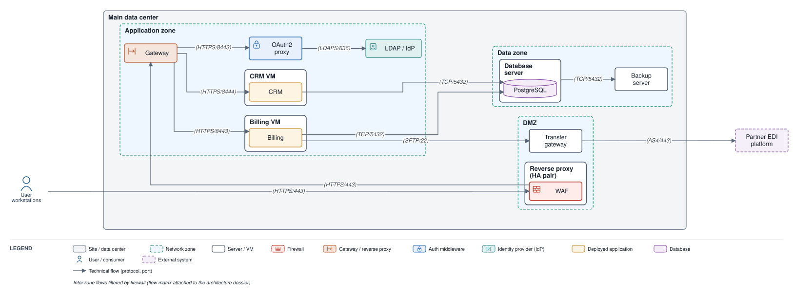</p>
<p align="center">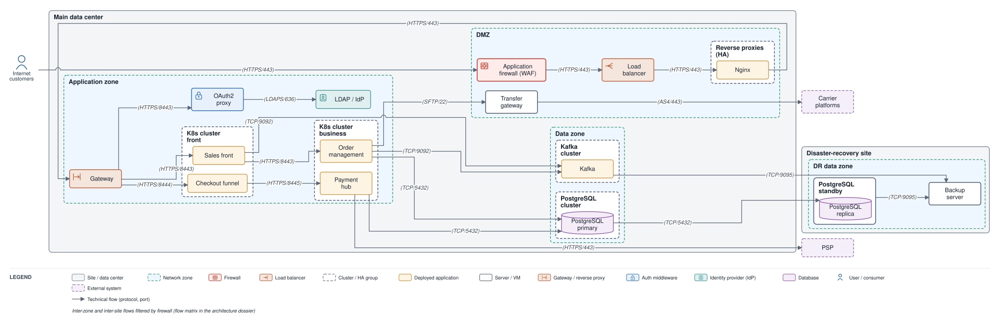</p>

#### Matrix flow export example (for the small diagram above)

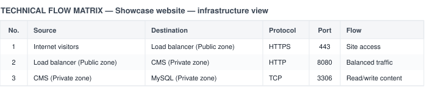

### Custom colours

Colours are resolved at three levels — most specific wins. From lowest to highest priority:

1. **Theme defaults** — per-kind colours defined by the selected theme (fill, stroke, text for each element kind).
2. **Diagram-level per-kind overrides** — override colours for all elements of a given kind in the `style` block:
   ```
   style {
     fill actor-group: #eef4fb
     stroke actor-group: #7a9cc4 dashed
     text block: #222233
     background: #fffdf5       # canvas background
   }
   ```
3. **Inline per-element styles** — override colour for a single element:
   ```
   block API "API gateway" { style { fill: #e8f5e9  stroke: #2e7d32  text: #1b5e20 } }
   ```

Flows can also be coloured inline:
```
COM_CTR -> OBS : "Alerts…" { label: above  stroke: dashed #a33  text: #a33 }
```

See [`examples/colors-custom.cairn`](examples/colors-custom.cairn) for a full example:

<p align="center">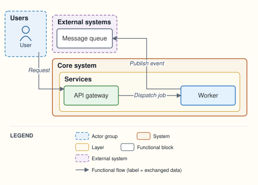</p>

### Positioning and flow line styles

Layout is automatic. When it gets a diagram wrong, four opt-in controls take
it back — a file that uses none of them renders exactly as before.

**Dashed and dotted flows.** The arrow glyph carries the line style. From
[`examples/positioning-sides.cairn`](examples/positioning-sides.cairn):

```
TASKS -> SCORING (MQ, JSON)                # solid — the default
SCORING --> REINSURER (SFTP, CSV)          # dashed
TRIAGE ..> REINSURER (API_REST, JSON)      # dotted
```

**Which side a flow leaves and arrives on.** Name the side on either endpoint,
or both. Sides read as the diagram is drawn — `left`, `right`, `top`, `bottom`.
Same file:

```
FORM.right -> TRIAGE.left (API_REST, JSON)   # both ends pinned
TRIAGE -> TASKS.bottom (MQ, JSON)            # only the arrival pinned
SCORING.top -> TRIAGE.right (API_REST, JSON) # a backward flow, pinned both ends
```

A pin fixes the two ends, not the path between them. The passes that would move a
terminal stand down — including the channel rerouting that would otherwise take
over a backward flow like the third one — while the route itself is still tidied,
along shapes that leave the pinned ends where you put them. A side the layout genuinely cannot reach is dropped
rather than forced into an unreadable route, and reported as `W0570` — never
silently ignored. Note that `A.right` loses to an element actually *named*
`A.right` (`W0571`), and an unknown side name is `E0223`.

<p align="center">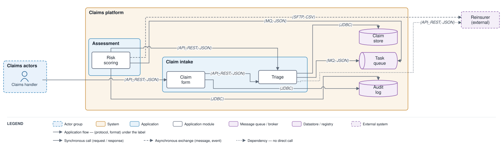</p>

**Element ordering.** `order:` is a statement in the element's own body — layout,
not style, so it does not go in a `style` block. Lower comes first in the reading
order the disposition defines: left to right for `wide`/`slide`, top to bottom
for `tall`/`page`. From
[`examples/placement/reading-order.cairn`](examples/placement/reading-order.cairn),
where two backends publishing to the same queue would otherwise be stacked:

```
application BACKEND_L1 "Line 1 backend" {
  order: 1
  module MSG_L1 "Messaging\nhandler"
}
application BACKEND_L2 "Line 2 backend" {
  order: 2
  module MSG_L2 "Messaging\nhandler"
}
```

<p align="center">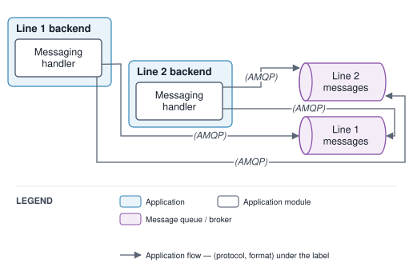</p>

Inside a container the axis flips, because a child's layer belongs to the flows
and elk honors no constraint that would change it: there `order:` sorts the
siblings sharing a layer — top to bottom in `wide`, left to right in `tall`. From
[`examples/positioning.cairn`](examples/positioning.cairn):

```
actor-group STAFF "Payment actors" {
  actor OPERATOR "Payment operator" {
    order: 1
  }
  actor AUDITOR "Compliance auditor" {
    order: 2
  }
}
```

Values need not be contiguous, and the hint never moves an element into another
band — an ordered actor-group stays on the entry side, ahead of the applications.
A top-level element nobody ordered follows the flows into the band of the latest
ordered element that reaches it, so a hint never drags a consumer ahead of its
own source; where a declared order does contradict a flow, the order wins and the
flow is drawn running backwards. The
attachment-sides file above orders its containers, its modules and its leaves
too, and ships as `wide`, `tall`, `slide` and `page` variants in
[`examples/dispositions/`](examples/dispositions/) — same ordering and the same
pins, four layouts. The file below orders the queue and the datastore inside
their system boundary and pins `POSTING.bottom -> LEDGER_DB.top`:

<p align="center">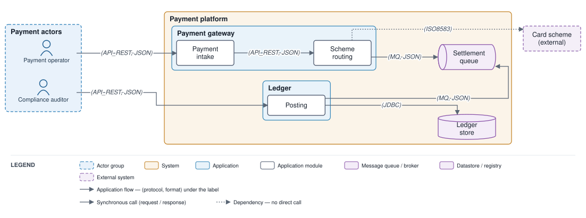</p>

Three files in [`examples/placement/`](examples/placement/) show both controls on
one shape: `baseline.cairn` declares neither, `sides.cairn` adds the pins above,
and `reading-order.cairn` sequences two backends with `order:`.

**Where the label sits on its flow.** This one *is* style (decision D4), so it
lives in the `style` block and resolves at the usual three levels — view default,
then diagram, then inline per flow:

```
style {
  flow-label: above     # on-line (default) | above | below
}

INTAKE -> ROUTING (API_REST, JSON)                     # above, from the style block
ROUTING --> SETTLE (MQ, JSON) { label: below }         # this one flow overrides it
```

- `on-line` — the default. The text is centred **on** the run, with a halo
  stroked behind it so the line does not cut through the words.
- `above` / `below` — lift the text clear of the run by a fixed offset before it
  is settled. Useful on a dense diagram where several runs share a corridor and
  the halos start eating each other.

The offset is applied first and the label is settled afterwards, so a placement
that would collide with another label still ends up somewhere readable — the
zero-overlap gate holds whichever value you pick. No shipped example sets it, so
every diagram above shows the `on-line` default.

### Dispositions

Same diagram different disposition : 
- [Slide disposition](https://cairn-psi-five.vercel.app/#src=ZGlhZ3JhbSBsb2dpY2FsICJPbmxpbmUgYXBwb2ludG1lbnQgYm9va2luZyDigJQgbG9naWNhbCB2aWV3IgpzdHlsZSB7IGRpc3Bvc2l0aW9uOiBzbGlkZSB9CgphY3Rvci1ncm91cCBVU0VSUyAiVXNlcnMiIHsKICBhY3RvciBQQVRJRU5UICJQYXRpZW50Igp9CgphY3Rvci1ncm91cCBTVEFGRiAiU3RhZmYiIHsKICBhY3RvciBTRUNSRVRBUlkgIk1lZGljYWwgc2VjcmV0YXJ5Igp9CgpzeXN0ZW0gQk9PS0lORyAiQXBwb2ludG1lbnQgYm9va2luZyBzeXN0ZW0iIHsKICBsYXllciBGUk9OVCAiUHJlc2VudGF0aW9uIGxheWVyIiB7CiAgICBibG9jayBQT1JUQUwgIkJvb2tpbmdcbnBvcnRhbCIKICB9CiAgbGF5ZXIgQlVTSU5FU1MgIkJ1c2luZXNzIGxheWVyIiB7CiAgICBibG9jayBTQ0hFRFVMRVIgIlNsb3Rcbm1hbmFnZW1lbnQiCiAgICBibG9jayBOT1RJRiAiTm90aWZpY2F0aW9ucyIKICB9Cn0KCmV4dGVybmFsIEVYVCAiRXh0ZXJuYWwgc3lzdGVtcyIgewogIGJsb2NrIFNNUyAiU01TIGdhdGV3YXkiCn0KCiMgLS0tLSBidXNpbmVzcyBvYmplY3RzIC0tLS0KYnVzaW5lc3Mtb2JqZWN0IEJPX0FQUFQgIkFwcG9pbnRtZW50IiAic2xvdCBib29rZWQgYnkgYSBwYXRpZW50IHdpdGggYSBwcmFjdGl0aW9uZXIiCmJ1c2luZXNzLW9iamVjdCBCT19TTE9UICJTbG90IiAidGltZSB3aW5kb3cgb3BlbiBmb3IgYm9va2luZyIKClBBVElFTlQgLT4gUE9SVEFMIDogIlNlYXJjaCBhIHNsb3RcbmFuZCBib29rIiBbQk9fU0xPVF0KUE9SVEFMIC0+IFNDSEVEVUxFUiA6ICJCb29raW5nIHJlcXVlc3QiIFtCT19BUFBUXQpTQ0hFRFVMRVIgLT4gTk9USUYgOiAiQXBwb2ludG1lbnQgY29uZmlybWVkIiBbQk9fQVBQVF0KTk9USUYgLT4gU01TIDogIlNlbmQgU01TIHJlbWluZGVyIgpTRUNSRVRBUlkgLT4gU0NIRURVTEVSIDogIk9wZW4gLyBibG9ja1xuc2xvdHMiIFtCT19TTE9UXQpTQ0hFRFVMRVIgLT4gUEFUSUVOVCA6ICJBcHBvaW50bWVudFxuY29uZmlybWF0aW9uIiBbQk9fQVBQVF0KCmxlZ2VuZCB7CiAgbm90ZSAiSGVhbHRoIGRhdGEgaXMgc3RvcmVkIG9uIGNlcnRpZmllZCBoZWFsdGgtZGF0YS1ob3N0aW5nIGluZnJhc3RydWN0dXJlIgp9Cg==)
- [Page disposition](https://cairn-psi-five.vercel.app/#src=ZGlhZ3JhbSBsb2dpY2FsICJPbmxpbmUgYXBwb2ludG1lbnQgYm9va2luZyDigJQgbG9naWNhbCB2aWV3IgpzdHlsZSB7IGRpc3Bvc2l0aW9uOiBwYWdlIH0KCmFjdG9yLWdyb3VwIFVTRVJTICJVc2VycyIgewogIGFjdG9yIFBBVElFTlQgIlBhdGllbnQiCn0KCmFjdG9yLWdyb3VwIFNUQUZGICJTdGFmZiIgewogIGFjdG9yIFNFQ1JFVEFSWSAiTWVkaWNhbCBzZWNyZXRhcnkiCn0KCnN5c3RlbSBCT09LSU5HICJBcHBvaW50bWVudCBib29raW5nIHN5c3RlbSIgewogIGxheWVyIEZST05UICJQcmVzZW50YXRpb24gbGF5ZXIiIHsKICAgIGJsb2NrIFBPUlRBTCAiQm9va2luZ1xucG9ydGFsIgogIH0KICBsYXllciBCVVNJTkVTUyAiQnVzaW5lc3MgbGF5ZXIiIHsKICAgIGJsb2NrIFNDSEVEVUxFUiAiU2xvdFxubWFuYWdlbWVudCIKICAgIGJsb2NrIE5PVElGICJOb3RpZmljYXRpb25zIgogIH0KfQoKZXh0ZXJuYWwgRVhUICJFeHRlcm5hbCBzeXN0ZW1zIiB7CiAgYmxvY2sgU01TICJTTVMgZ2F0ZXdheSIKfQoKIyAtLS0tIGJ1c2luZXNzIG9iamVjdHMgLS0tLQpidXNpbmVzcy1vYmplY3QgQk9fQVBQVCAiQXBwb2ludG1lbnQiICJzbG90IGJvb2tlZCBieSBhIHBhdGllbnQgd2l0aCBhIHByYWN0aXRpb25lciIKYnVzaW5lc3Mtb2JqZWN0IEJPX1NMT1QgIlNsb3QiICJ0aW1lIHdpbmRvdyBvcGVuIGZvciBib29raW5nIgoKUEFUSUVOVCAtPiBQT1JUQUwgOiAiU2VhcmNoIGEgc2xvdFxuYW5kIGJvb2siIFtCT19TTE9UXQpQT1JUQUwgLT4gU0NIRURVTEVSIDogIkJvb2tpbmcgcmVxdWVzdCIgW0JPX0FQUFRdClNDSEVEVUxFUiAtPiBOT1RJRiA6ICJBcHBvaW50bWVudCBjb25maXJtZWQiIFtCT19BUFBUXQpOT1RJRiAtPiBTTVMgOiAiU2VuZCBTTVMgcmVtaW5kZXIiClNFQ1JFVEFSWSAtPiBTQ0hFRFVMRVIgOiAiT3BlbiAvIGJsb2NrXG5zbG90cyIgW0JPX1NMT1RdClNDSEVEVUxFUiAtPiBQQVRJRU5UIDogIkFwcG9pbnRtZW50XG5jb25maXJtYXRpb24iIFtCT19BUFBUXQoKbGVnZW5kIHsKICBub3RlICJIZWFsdGggZGF0YSBpcyBzdG9yZWQgb24gY2VydGlmaWVkIGhlYWx0aC1kYXRhLWhvc3RpbmcgaW5mcmFzdHJ1Y3R1cmUiCn0K)


### Numbered flows

> This example has a large number of flows on purpose in order to showcase how it renders. But in such a case, it's best to consider breaking the diagram into two diagrams : one more general one more zoomed in.

<p align="center">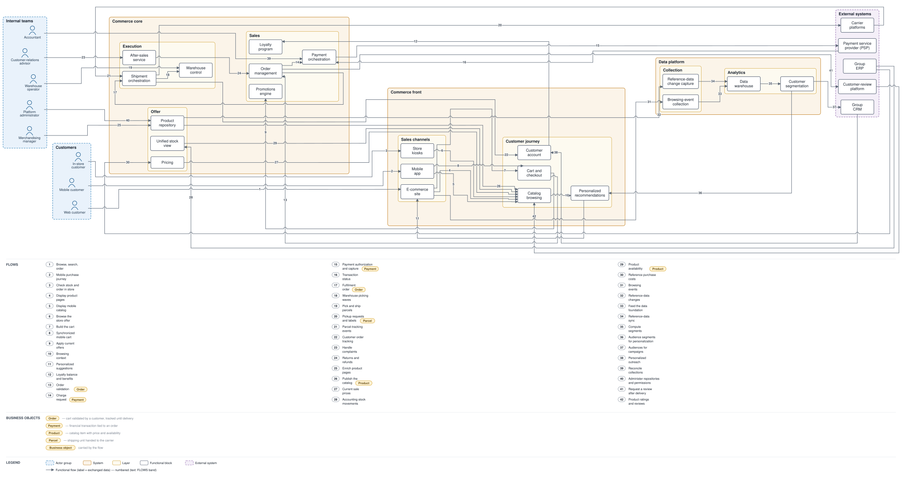</p>

### Themes

Cairn comes with a collection of built-in themes. Choose the one that best fits your presentation or documentation style:

<table align="center">
  <tr>
    <td align="center"><strong>Classic</strong><br>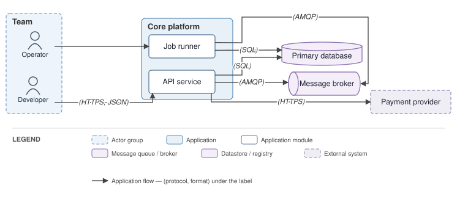</td>
    <td align="center"><strong>Classic Dark</strong><br>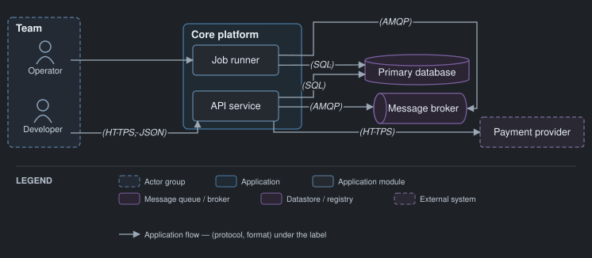</td>
    <td align="center"><strong>Light</strong><br>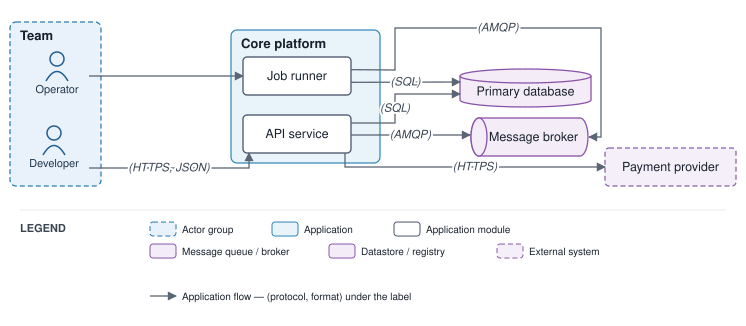</td>
  </tr>
  <tr>
    <td align="center"><strong>Dark</strong><br>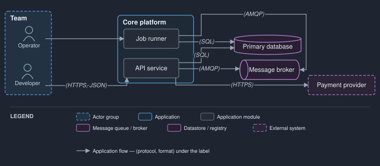</td>
    <td align="center"><strong>Contrast</strong><br>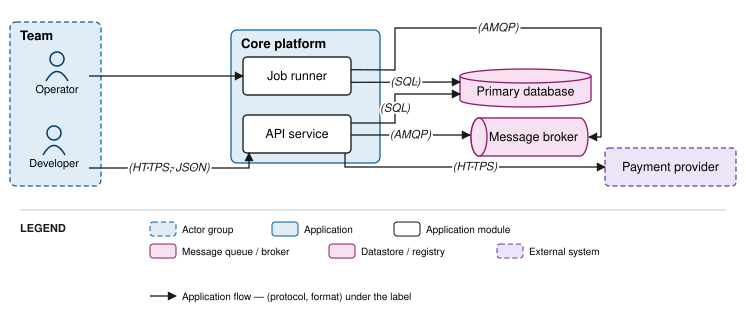</td>
    <td align="center"><strong>Nord</strong><br>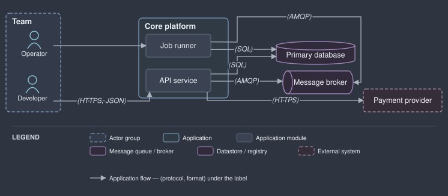</td>
  </tr>
  <tr>
    <td align="center"><strong>Sand</strong><br>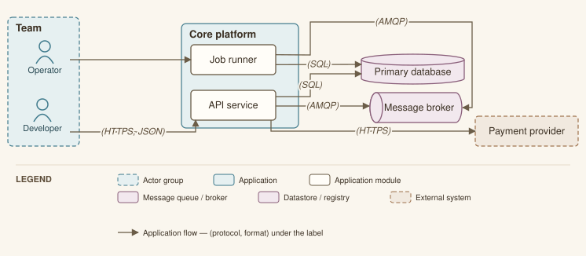</td>
    <td align="center"><strong>Slate</strong><br>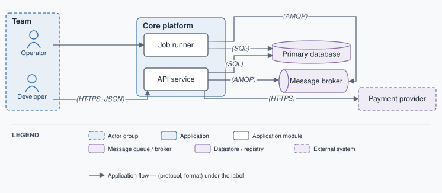</td>
    <td align="center"><strong>Solarized</strong><br>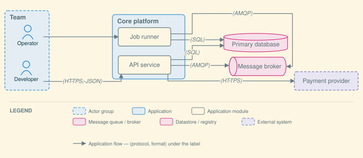</td>
  </tr>
</table>

## Installation

Prebuilt, self-contained binaries are published on every `v*` tag (no runtime needed). Pick your platform:

```sh
# macOS / Linux — curl installer 
curl -fsSL https://raw.githubusercontent.com/R0kshan/cairn/main/packaging/install.sh | sh

# macOS / Linux — Homebrew
brew install R0kshan/tap/cairn

# Windows — Scoop
scoop bucket add cairn https://github.com/R0kshan/scoop-bucket
scoop install cairn
```

From source (no release needed — requires Node ≥ 22.6):

```sh
git clone https://github.com/R0kshan/cairn && cd cairn
npm install
npm run cairn -- --help          # or: node bin/cairn.js --help
```

## Commands

Once installed, the command is `cairn`. From a clone, run `npm run cairn -- <command>`.

### Scaffold a typed starter file

```sh
cairn new -L my-system.cairn        # -L logical · -A application · -I infrastructure
```

The chosen view is written into the file header (`diagram logical …`); every other command reads it from there.

### Check a diagram (syntax, schema, completeness)

```sh
cairn validate my-system.cairn      # --format json for CI/agents · --strict to fail on warnings
```

Problems are reported as source-located, coded diagnostics with a suggested fix:

```text
error[E0210]: functional block outside any system (`ORPHAN`)
 --> my-system.cairn:8:7
  |
8 | block ORPHAN "Floating block"
  |       ^^^^^^
help: move this `block` inside a `layer`, `system` or `external`
```

### Render to SVG

```sh
cairn build my-system.cairn -o my-system.svg     # -o optional; defaults to the same name, .svg
```

On validation errors nothing is written and the exit code is 1; warnings are printed but do not block.

### Export the flow matrix

```sh
cairn matrix my-infra.cairn --format csv    # csv (default) | md | svg · -o to set the path
```

Every view exports one; the columns follow the view (infrastructure keeps protocol and port, application keeps the protocol alone, logical keeps just the exchange).

### Rebuild on every save

```sh
cairn watch my-system.cairn
```

Rebuilds the SVG on save. On a compile error the SVG becomes an error panel (codes, lines, help), so an open preview never shows a stale diagram. Watch observes only the file it was launched on — run one per file. Pair it with an editor that auto-refreshes an open SVG.

### Explain a diagnostic

```sh
cairn explain E0240
```

```text
E0240 — The infrastructure view requires every flow to carry its protocol (and port if
relevant): the flow matrix is the primary output of this view. Add `(HTTPS/443)` after the label.
```

### Check your version

```sh
cairn version    # or --version / -v
```

Released binaries (the ones from Homebrew, Scoop, or the GitHub Releases page) print the exact tag they were built from. Running from a clone via `npm run cairn` prints `package.json`'s version instead.

## More

- [`DIAGNOSTICS.md`](documentation/DIAGNOSTICS.md) — every diagnostic code and its meaning.
- [`DSL_SPEC.md`](documentation/DSL_SPEC.md) — the DSL syntax.
- [`ARCHITECTURE.md`](documentation/ARCHITECTURE.md) — how the pipeline fits together, for contributors.
- [`CONTRIBUTING.md`](CONTRIBUTING.md) — how to open a PR, and the gates it must pass.
- [`documentation/`](documentation/) — architecture, invariants, DSL and internals.
